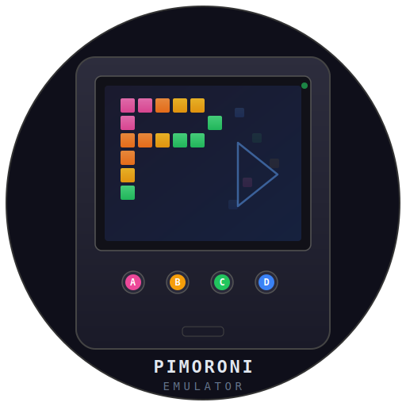
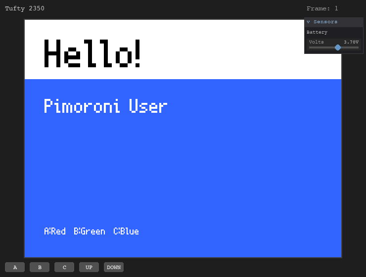
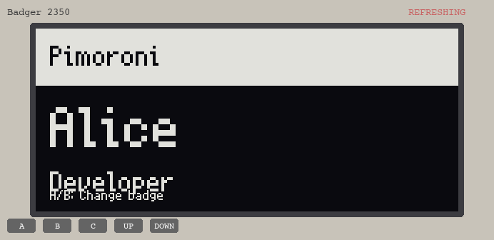
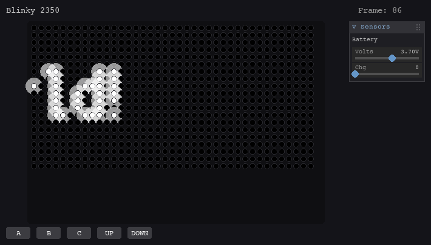
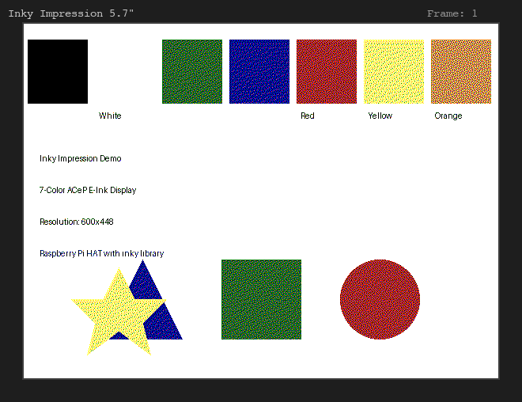
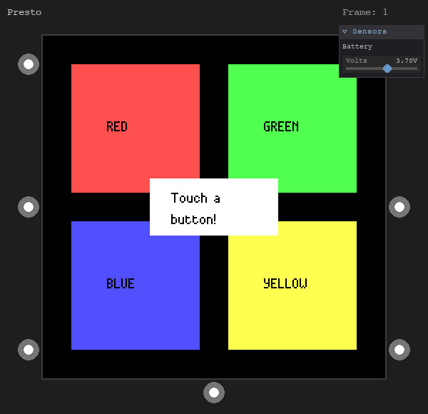

<p align="center">
  
</p>

<h1 align="center">pimoroni-emu</h1>

<p align="center">
  <a href="https://github.com/iksaif/pimoroni-emu/actions/workflows/ci.yml"></a>
  <a href="https://pypi.org/project/pimoroni-emulator/"></a>
  <a href="https://github.com/iksaif/pimoroni-emu/blob/main/LICENSE"></a>
  
</p>

<p align="center">
Desktop emulator for <a href="https://shop.pimoroni.com/">Pimoroni</a> devices. Run MicroPython and Raspberry Pi apps on your desktop with simulated displays, buttons, and touch input.
</p>

> **Note:** This is an unofficial community project and is not affiliated with or endorsed by [Pimoroni](https://shop.pimoroni.com/).

## Screenshots

### Badges & displays

| Tufty 2350 | Badger 2350 |
|:-:|:-:|
|  |  |

### Badgeware (LED matrix)

| Blinky 2350 |
|:-:|
|  |

### Inky

| Inky Frame 7.3" | Inky Impression 5.7" |
|:-:|:-:|
|  |  |

### Presto

| Presto |
|:-:|
|  |

## Install

```bash
pip install pimoroni-emulator
```

Or from source:

```bash
git clone --recurse-submodules https://github.com/iksaif/pimoroni-emu
cd pimoroni-emulator
pip install -e ".[dev]"
```

## Usage

```bash
# Run an app on a specific device
pimoroni-emulator --device tufty apps/tufty/hello_badge.py
pimoroni-emulator --device presto apps/presto/touch_demo.py
pimoroni-emulator --device badger apps/badger/hello_badge.py
pimoroni-emulator --device inky_frame apps/inky_frame/hello_inky.py
pimoroni-emulator --device inky_impression apps/inky_impression/hello_impression.py

# Run Blinky apps (auto-detected from path)
pimoroni-emulator apps/blinky/snake.py

# Device is auto-detected from app path
pimoroni-emulator apps/tufty/hello_badge.py

# List all supported devices
pimoroni-emulator --list-devices

# Headless mode (for CI/testing)
pimoroni-emulator --device tufty --headless --max-frames 5 app.py

# Save frames to disk
pimoroni-emulator --device presto --autosave frames/ app.py

# Enable API call tracing
pimoroni-emulator --device tufty --trace app.py

# Scale display window
pimoroni-emulator --device tufty --scale 3 app.py
```

### Keyboard controls

- **Q / Escape** - Quit
- **A, S, D, F, G** - Buttons A-E (device-dependent)
- **Up / Down** - UP/DOWN buttons (Tufty, Badger)
- **Mouse click** - Touch input (Presto)

#### QwSTPad gamepad (Presto, Blinky)

When an app creates a QwSTPad instance, a clickable gamepad widget appears below the display:

- **Arrow keys** - D-pad (U/D/L/R)
- **Z / X / C / V** - Face buttons (A/B/X/Y)
- **= / -** - Plus/Minus buttons

## Compatibility matrix

### Devices

| Family | Device | Display | Resolution | Library | Status |
|--------|--------|---------|------------|---------|--------|
| **Tufty** | Tufty 2350 | TFT IPS | 320x240 | PicoGraphics | Working |
| **Blinky** | Blinky 2350 | LED matrix | 39x26 | Badgeware | Working |
| **Presto** | Presto | TFT IPS touch | 480x480 | PicoGraphics | Working |
| **Badger** | Badger 2350 | E-ink mono | 296x128 | PicoGraphics | Working |
| **Inky Frame** | 7.3" | E-ink 6-color | 800x480 | PicoGraphics | Working |
| | 5.8" | E-ink 7-color | 600x448 | PicoGraphics | Working |
| | 4.0" | E-ink 7-color | 640x400 | PicoGraphics | Working |
| **Inky Impression** | 7.3" | E-ink 6-color | 800x480 | inky (RPi) | Working |
| | 5.7" | E-ink 7-color | 600x448 | inky (RPi) | Working |
| | 4.0" | E-ink 7-color | 640x400 | inky (RPi) | Working |
| | 13.3" | E-ink 6-color | 1200x1600 | inky (RPi) | Working |

### Mock modules

| Module | Coverage | Notes |
|--------|----------|-------|
| `picographics` | Good | Drawing primitives, text, fonts, framebuffer |
| `pimoroni` | Good | Button class, RGBLED |
| `machine` | Partial | Pin, PWM, I2C, SPI stubs |
| `presto` | Good | Presto class, touch |
| `badger2040` | Good | Badger2040 class |
| `badgeware` | Partial | Drawing API for Blinky |
| `inky` | Good | Inky, InkyImpression, auto-detect |
| `inky_frame` | Good | InkyFrame class |
| `network` / `socket` | Good | WiFi connect, sockets pass through to host |
| `jpegdec` / `pngdec` | Good | Decode via Pillow, render to framebuffer |
| `picovector` | Good | Vectors, polygons, .af fonts, SVG loading |
| `qwstpad` | Good | Gamepad input via keyboard/mouse, LED indicators |
| Sensors | Stubs | BME280, LTR559, LSM6DS3 |

## Not yet working

### Hard

- **Memory constraints** - Basic heap tracking exists (`--memory-tracking`) via `tracemalloc` with CPython-to-MicroPython scaling, but it's approximate. True byte-accurate simulation would need a custom allocator.
- **I2C/SPI peripherals** - Stubs return zeros. Full simulation would require modeling each breakout board's register map.

## Testing

```bash
pytest tests/ -v
```

The test harness supports headless execution, screenshot capture, button simulation, and touch input:

```python
from emulator.testing import DeviceTest

class TestMyApp(DeviceTest):
    device = "tufty"
    app = "apps/tufty/hello_badge.py"

    def test_display(self):
        self.run_frames(5)
        self.screenshot("output.png")

    def test_button(self):
        self.click_button("A")
        self.run_frames(3)
```

## Architecture

```
emulator/
  __main__.py          # CLI entry point
  main.py              # App runner, event loop
  devices/             # Device configs (resolution, buttons, features)
  display/             # Renderers (TFT, LED matrix, e-ink)
  hardware/            # Input simulation (buttons, touch, sensors)
  mocks/               # MicroPython module replacements (~38 modules)
  testing/             # Test harness and screenshot comparison
vendor/                # Upstream submodules (read-only reference)
apps/                  # Demo applications
```

The emulator injects mock modules into `sys.modules` before running your app. Three mock profiles exist:
- **PicoGraphics** - For Tufty, Presto, Badger, Inky Frame
- **Badgeware** - For Blinky 2350
- **inky** - For Inky Impression (Raspberry Pi)

## License

MIT. See [LICENSE](LICENSE).

Vendor submodules under `vendor/` are all MIT-licensed (Pimoroni Ltd).
