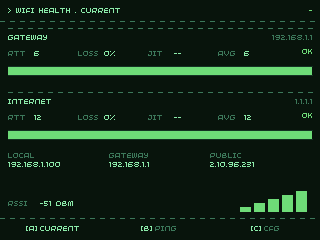

# WiFi Health — Tufty 2350

A 3-screen WiFi diagnostics app for the Tufty 2350 badge, driven by the
badgeware API (buttons instead of touch).



## Screens

| Button | Screen   | Description |
|--------|----------|-------------|
| **A**  | CURRENT  | Live GATEWAY + INTERNET rows: RTT, loss %, jitter, avg. Public IP. RSSI bar. Forces a fresh sample. |
| **B**  | PING     | RTT trend plots for gateway and internet channels over the last 48 samples. |
| **C**  | CFG      | Settings: sample period, RSSI thresholds, loss warn level, colour theme. UP/DOWN to navigate, A to cycle values. |

## Running

```bash
python -m emulator --device tufty apps/wifi_health_tufty/__init__.py
```

Headless smoke test:

```bash
python -m emulator --device tufty --headless --max-frames 10 apps/wifi_health_tufty/__init__.py
```

## Configuration

Create a `secrets.py` beside the app (or in `/system/apps/wifi_health_tufty/`) with:

```python
WIFI_SSID = "MyNetwork"
WIFI_PASSWORD = "secret"
```

## Network probes

The app has no real ICMP ping on MicroPython, so it approximates round-trip
time by timing a TCP three-way handshake:

- **GATEWAY** — TCP port 80 to the DHCP-reported gateway
- **INTERNET** — TCP port 53 to Cloudflare (1.1.1.1)

Public IP is fetched from `api.ipify.org` and cached for 60 s.
